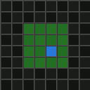

# ChunkVis

A Fabric mod for Minecraft 1.21.1 that shows visited chunks in a minimap and full-screen map. Perfect for use with [Simple World Downloader](https://modrinth.com/mod/simple-world-downloader) to track which chunks you've already visited and downloaded.



## Features

- **Minimap overlay** — press `U` to toggle. Shows the actual terrain rendered from above with visited chunks highlighted in green
- **Full-screen map** — press `M` to open. Scroll to zoom, drag to pan
- **In-world chunk grid** — colored chunk overlays rendered at your feet
- **Tracks chunks** as you walk/fly — starts fresh each time you press `U`
- **Auto-saves** visited chunk data so you can resume later

## Controls

| Key | Action |
|-----|--------|
| `U` | Toggle minimap + start/stop tracking (resets each time) |
| `M` | Open full-screen interactive map |

## Requirements

- Minecraft 1.21.1
- Fabric Loader >=0.15.0
- Fabric API

## Usage

1. Press `U` to enable tracking — the minimap appears and starts counting visited chunks from zero
2. Walk or fly around — visited chunks turn green on both the minimap and in-world
3. Press `U` again to stop and reset
4. Press `M` at any time to open the full-screen map

The minimap renders block colors from the world surface so you can recognize terrain features.

## Building from source

```bash
./gradlew build
```

The built jar will be in `build/libs/`.
